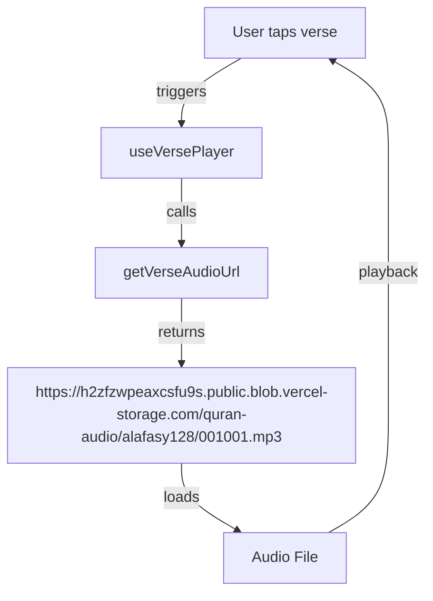

# Active Context: Quran Expo Web App

## Current Focus: Homepage Development

We are currently focused on developing the homepage for the Quran Expo web application. This is the first step in our port from the native iOS app to a web application using Astro, Preact, and TailwindCSS.

### Immediate Goal
Create a visual representation of the homepage that matches the design and functionality of the native iOS app homepage, using placeholder data where necessary.

## Recent Work & Decisions

The project is in its initial stages with the following recent progress:

1. **Project Setup**
   - Established Astro framework with Preact integration
   - Added TailwindCSS for styling
   - Set up TypeScript for type safety

2. **Technical Decisions**
   - Decided to use Astro for its excellent performance characteristics and partial hydration
   - Selected Preact over React for smaller bundle size
   - Adopted TailwindCSS for responsive design and consistent styling
   - Decided to use the same API endpoints as the native app for data consistency

3. **Memory Bank Creation**
   - Established core documentation to guide development
   - Documented project brief, context, and system patterns
   - Created technical documentation for reference

4. **Settings Implementation Planning** (Added 2025-05-20)
   - Planned implementation of a settings system with Nanostores for state management
   - Documented approach in memory-bank/settings-implementation-plan.md
   - First setting to implement will be autoplay for verse audio

## Current Challenges & Considerations

1. **Native to Web Translation**
   - Determining how to best replicate native app animations and transitions in web context
   - Mapping native app layout and styling to responsive web design
   - Converting iOS-specific design elements to web equivalents

2. **API Integration**
   - Understanding the existing API structure used by the native app
   - Planning for efficient data fetching and caching strategies
   - Handling potential cross-origin issues with API endpoints

3. **Homepage Component Structure**
   - Identifying core components needed for the homepage
   - Determining the correct hierarchy and composition of components
   - Planning for responsive behavior across device sizes

4. **Audio Integration Planning**
   - Understanding how audio is handled in the native app
   - Planning for efficient audio loading and playback in the web context
   - Considering browser compatibility for audio features
   - Implementing autoplay functionality for continuous verse playback

## Next Steps (Prioritized)

1. **Analyze Native App Homepage**
   - Review screenshots of the iOS app homepage
   - Identify all UI elements and their relationships
   - Note animations, transitions, and interactive elements

2. **Create Homepage Component Structure**
   - Define the component hierarchy for the homepage
   - Create skeleton components with proper props interfaces
   - Establish layout grid and responsive breakpoints

3. **Implement Visual UI Elements**
   - Develop Background component
   - Create Header/Navigation components
   - Implement Verse of the Day component
   - Build Category or Feature cards
   - Develop Bottom Navigation component

4. **Add Styling and Visual Polish**
   - Apply TailwindCSS styles matching native app design
   - Implement custom CSS for elements that require it
   - Ensure responsive behavior matches expectations

5. **Integrate Placeholder Data**
   - Create mock data structures matching API response formats
   - Integrate placeholder data into components
   - Prepare for real API integration in future work

6. **Implement Settings System** (Added 2025-05-20)
   - Set up Nanostores for state management
   - Create settings page with toggle UI
   - Implement autoplay functionality in audio player
   - Ensure settings persist between sessions

## Open Questions & Decisions Needed

1. How closely should we follow the native app's exact measurements vs. adapting for web best practices?
2. Should we prioritize exact visual fidelity or optimize for web performance where trade-offs exist?
3. How will we handle features that rely on native device capabilities not available in web browsers?
4. What approach should we take for animations and transitions to match the native feel?

## Dependencies & Blockers

1. **Required Resources**
   - Screenshots of the native iOS app homepage
   - Understanding of the API structure and endpoints
   - Information about fonts used in the native app

2. **Potential Blockers**
   - Missing design assets or specifications
   - Unknown API endpoints or authentication requirements
   - Browser-specific limitations for audio or animation features
---

## Audio File Access: Vercel Blob Store Integration (2025-05-20 update)

- Audio files for verse playback will now be fetched from the public Vercel Blob store at:
  ```
  https://h2zfzwpeaxcsfu9s.public.blob.vercel-storage.com/quran-audio/alafasy128/{surahId}{verseNumber}.mp3
  ```
- No token is required for public GET access in the browser.
- The function for constructing audio URLs will be updated in [`src/utils/audioUtils.ts`](src/utils/audioUtils.ts) to reflect this.



- The previous URL (`https://audio.quranexpo.com/...`) will be replaced everywhere with the above.
- If you later need to upload/manage files, use the read-write token ONLY server-side.

---